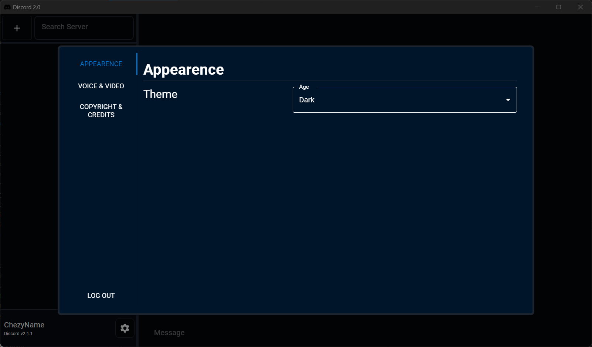
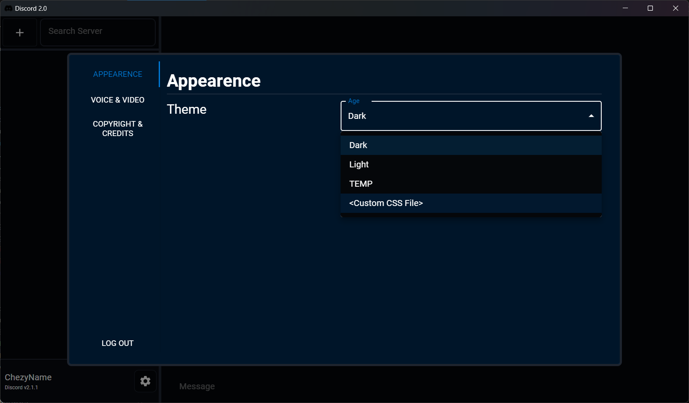

<!---
<div align="center">
    <h1 style="font-size: 4em"> Discord II </h1>
    Custom Discord with User Hosted Severs
</div>
-->

# Why Discord II?
Discord 2 was created as a side project mainly because I was bored and see what I could do, but also as a way for users to 'own' their own data.

When you use Discord, all your data is managed and hosted by them meaning they could ***theoretically*** sell your data.


In Discord 2, Users are able to keep most of thier data on thier machine, since the user is not required to Login and the server can be hosted on the users own machine as well.

## Features
- No Login Required
- User Hosted Servers
- Custom Themes


# Usage
> Currently Discord 2 Supports **ONLY** Windows as thats what My Machine is, Learn how to Build the project on your Machine.

Download and Run `Discord 2.0.exe`, Thats It!

# Custom Themes
## Creating Custom Theme
Create a new css file, or a file ending with `.css`, Inside the file,
enter the colors that you wish to be replaced for the following:

> If you are an advanced user, you can theoretically modify the enitre app by creating one large `css` file
> which can modify each component of the user interface. I personally have not tried this but it could be possible

Dark Mode Example
``` css
:root {
    --Primary: rgba(0, 41, 82, 0.5);        /* Primary Color                */
    --Secondary: rgb(9, 11, 17);            /* Secondary Color              */
    --Background: hsl(220, 35%, 3%);        /* Background Color             */
    --Outlines: hsl(220deg 20% 25% / 60%);  /* Outline for Most Objects     */
    --Text: #fff;                           /* Text Color                   */
    --Interactable: hsl(220, 35%, 3%);      /* Color for All Interactables  */
}
```

## Loading Theme
Just go to `Settings` by clicking on the Cog, and Entering Appearence where you can select your theme.
<div style="display: flex; flex-direction: row;">
    
    
</div>


# Hosting your Own Server
Hosting your Server is pretty easy depending on which option you select.
You can host via the Go code under `/Server/`, by running `go run .` or `go run . --port=7777 --debug=true --name=DEBUG`

## Running Server.exe [Windows Only]
This is the easier option as you just run an executable. When running the executable 
that can be downloaded from [here](https://github.com/ChezyName/Discord-2.0/releases/latest),

Once you do that you can either just run the executable for it to pick a random name and host the server on port `3000`,
or you can use the following settings to spice things up.


``` bash
DiscordServer.exe --debug=false --port=6557 --name="My Awesome Discord 2.0 Server"
```

Where
`--debug` allows for users to hear themselves when joining the server, basically an echo style command.
`--port`  is the port the server runs on, the message gateway, the data server, and the voice server.
`--name`  changes the name of the server the users see

> ATTENTION! The Messages on the Server is stored in the RAM meaning that once the server is turned off, All the messages on the server will go away.

# Contributing
Honestly, I don't think Contributing is worth it for someone like you since the code is pretty rough, Especially on the Rust
side since this is one of my first times using Rust. So if you wanna use this code, good luck.

**NOTE!**

If you are using Windows, you need [ASIO](https://think-async.com/Asio/) and [CMake](https://cmake.org/download/) on your machine configured in order to use CPAL (Cross-Platform-Audio-Library),
I have no clue about any other device but it most likely requires something similar.

The files on the front end in `/Client/src/components` are self-explanatory but the Rust code is not as such

## Rust
In the rust code, there are 3 main components that you must be aware of, Discord Driver is what holds most of the data
and state changes on the rust side, while AudioDriver located in `audiodriver.rs` is responsible for files related to the
audio settings, but also contains functions for sending and receiving audio.

Both the lib and audiodriver files are very large and will prob require a full day to read thru them,
Additionally there are a ton of functions that are not used but 'if its not broken, don't fix it.'

# Performance and Optimization
This project can defently be more optimized and could handle hundreds of users if Multi-threaded (Server side) and a few more optimizations

Here is the Server Statistics for single user (talking and sending messages)
> Note this is done locally meaning there is no packet loss and zero RTT
```
---- Server Info ----
Name: Solemn Haven
Port: 3000
Uptime: 00:01:37

---- Server Stats ----
PID: 18332
CPU Usage: 44.34%
Memory Usage: 18.25 MB
Disk Read: 0.00 MB
Disk Write: 0.00 MB

---- Network Stats ----
Network Speed           | Sent: 69.62 KB/s | Received: 33.17 KB/s
Network Speed [VOICE]   | Sent: 1.78 KB/s  | Received: 31.98 KB/s

Total Network           | Sent: 1862.10 KB   | Received: 910.72 KB
Total Network [VOICE]   | Sent: 1823.54 KB   | Received: 927.98 KB
Total Network [MESSAGE] | Sent: 0.00 KB      | Received: 0.01 KB
Total Network [DATA]    | Sent: 38.55 KB     | Received: 0.00 KB

---- User Stats ----
ChezyName | 127.0.0.1:63246
          Messages Sent: 0
          Network Speed: Sent: 10.76 KB/s  | Received: 5.38 KB/s
          Total Network: Sent: 610.09 KB   | Received: 320.71 KB
Chezy | 127.0.0.1:51730
      Messages Sent: 0
      Network Speed: Sent: 11.16 KB/s  | Received: 5.58 KB/s
      Total Network: Sent: 634.18 KB   | Received: 318.52 KB
ChezyDev | 127.0.0.1:51732
          Messages Sent: 0
          Network Speed: Sent: 10.06 KB/s  | Received: 5.03 KB/s
          Total Network: Sent: 579.27 KB   | Received: 290.26 KB
```

Currently CPU is kind of high running @ `Intel(R) Core(TM) i7-10750H CPU @ 2.60GHz, 2592 Mhz, 6 Core(s), 12 Logical Processor(s)`
Goal is to reduce CPU strain on Server

# Credits and Copyright
Discord 2 is an independent project and is not affiliated, associated, authorized, endorsed by, or in any way officially connected with Discord Inc. The name "Discord" and its logo are trademarks of Discord Inc. All rights regarding the Discord name and logo are owned by Discord Inc.

[MIT](/LICENSE) © ChezyName 2024 - 2025
